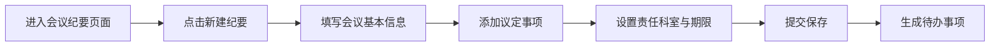

## 1. 产品概述

内部会议纪要管理系统，用于记录会议议定事项、跟踪任务落实情况，提高会议决议的执行效率和透明度。

- 面向用户：单位内部工作人员、各科室负责人
- 核心价值：会议决议可追溯、任务进度可视化、逾期提醒自动化

## 2. 核心功能

### 2.1 用户角色

| 角色 | 说明 | 核心权限 |
|------|------|----------|
| 工作人员 | 会议纪要录入人员 | 创建纪要、查看所有事项、更新进展 |
| 科室负责人 | 各责任科室人员 | 按科室查看待办、更新本科室事项进展 |

### 2.2 功能模块

1. **首页概览**：逾期事项提醒、本周到期事项、数据统计卡片
2. **会议纪要管理**：纪要列表、新建纪要、纪要详情查看
3. **待办事项管理**：按责任科室筛选、事项进展更新、完成状态标记

### 2.3 页面详情

| 页面名称 | 模块名称 | 功能描述 |
|----------|----------|----------|
| 首页 | 数据概览卡片 | 总纪要数、待办事项数、逾期事项数、本周到期数 |
| 首页 | 逾期提醒列表 | 展示所有已逾期的议定事项，红色警示标识 |
| 首页 | 本周到期列表 | 展示本周内到期的待办事项，橙色提醒标识 |
| 会议纪要 | 纪要列表 | 按时间倒序展示所有会议纪要，支持搜索筛选 |
| 会议纪要 | 新建纪要 | 填写会议主题、参会部门、时间、议定事项等 |
| 会议纪要 | 纪要详情 | 查看完整纪要内容及所有关联事项进度 |
| 待办事项 | 科室筛选 | 按责任科室筛选待办事项列表 |
| 待办事项 | 进展更新 | 更新事项进展描述、标记完成状态 |

## 3. 核心流程

### 3.1 会议纪要创建流程

工作人员在会议结束后，进入"会议纪要"页面，点击"新建纪要"，填写会议主题、参会部门、会议时间，逐条添加议定事项（包含事项内容、责任科室、完成期限），提交后保存到系统。

### 3.2 事项跟踪更新流程

用户可在首页或待办事项页面查看事项列表，点击事项进入详情，更新当前进展描述，可标记为"进行中"或"已完成"，系统自动记录更新时间。

## 4. 用户界面设计

### 4.1 设计风格

- **主色调**：深邃蓝 #1e3a8a，体现专业稳重的企业气质
- **辅助色**：琥珀橙 #f59e0b（提醒）、红色 #dc2626（逾期警示）、绿色 #16a34a（已完成）
- **中性色**：石板灰系列，层次分明
- **字体**：正文使用思源黑体 / Noto Sans SC，标题使用 Inter 或系统无衬线字体
- **布局**：顶部导航栏 + 左侧菜单 + 主内容区，经典后台管理布局
- **卡片风格**：圆角 12px，轻微阴影，悬停时阴影加深
- **图标风格**：线性简洁图标，使用 lucide-react 图标库

### 4.2 页面设计概览

| 页面名称 | 模块名称 | UI 元素 |
|----------|----------|---------|
| 首页 | 数据概览卡片 | 4个统计卡片，图标+数字+环比，渐变色背景 |
| 首页 | 逾期提醒 | 红色标题栏，事项列表带倒计时，警示图标 |
| 首页 | 本周到期 | 橙色标题栏，事项列表带日期，提醒图标 |
| 会议纪要 | 列表页 | 表格布局，搜索框+筛选按钮，新建按钮 |
| 会议纪要 | 新建/详情 | 表单布局，分组卡片，事项可动态增删 |
| 待办事项 | 列表页 | 科室标签筛选，事项卡片，状态标签 |

### 4.3 响应式设计

- 桌面端（1280px+）：完整三栏布局，表格展示
- 平板端（768-1279px）：左侧菜单收起为图标模式
- 移动端（<768px）：顶部导航，底部标签栏切换，卡片式列表

### 4.4 交互动效

- 页面切换：淡入淡出过渡，200ms
- 卡片悬停：上移 2px + 阴影加深，150ms 过渡
- 按钮点击：轻微缩放反馈
- 状态变更：颜色渐变过渡
- 数据加载：骨架屏占位，脉冲动画
