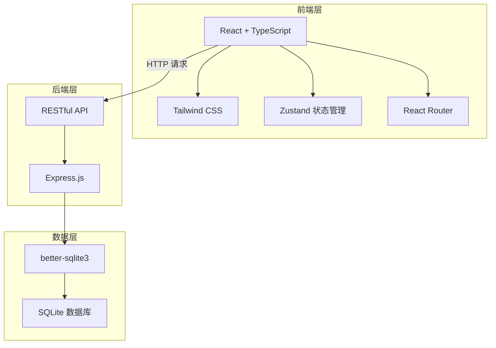
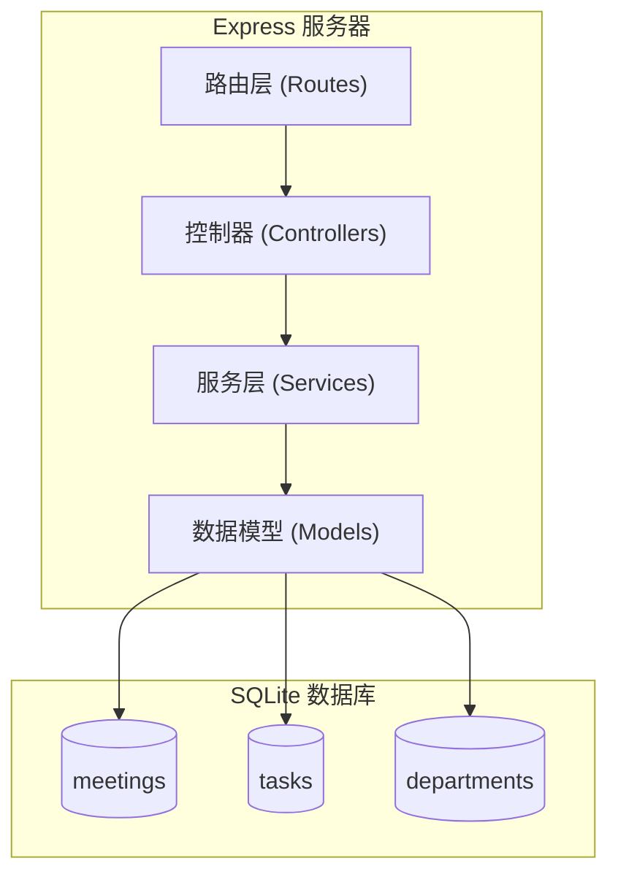
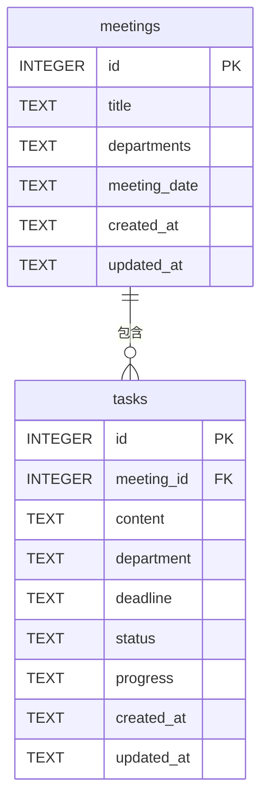

## 1. 架构设计



## 2. 技术描述

- **前端**：React 18 + TypeScript + Tailwind CSS 3 + Vite
- **状态管理**：Zustand
- **路由**：react-router-dom v6
- **后端**：Express.js 4 + TypeScript
- **数据库**：SQLite (better-sqlite3)
- **图标库**：lucide-react
- **初始化工具**：vite-init
- **项目模板**：react-express-ts

## 3. 路由定义

### 3.1 前端路由

| 路由路径 | 页面组件 | 功能描述 |
|----------|----------|----------|
| `/` | Dashboard | 首页概览，逾期提醒、本周到期 |
| `/meetings` | MeetingList | 会议纪要列表 |
| `/meetings/new` | MeetingNew | 新建会议纪要 |
| `/meetings/:id` | MeetingDetail | 会议纪要详情 |
| `/tasks` | TaskList | 待办事项（按科室筛选） |

### 3.2 后端 API 路由

| 方法 | 路径 | 功能描述 |
|------|------|----------|
| GET | `/api/meetings` | 获取会议纪要列表 |
| GET | `/api/meetings/:id` | 获取单个会议纪要详情 |
| POST | `/api/meetings` | 创建新的会议纪要 |
| GET | `/api/tasks` | 获取待办事项列表（支持科室筛选） |
| GET | `/api/tasks/overdue` | 获取逾期事项列表 |
| GET | `/api/tasks/this-week` | 获取本周到期事项列表 |
| PATCH | `/api/tasks/:id` | 更新事项进展和状态 |
| GET | `/api/departments` | 获取所有科室列表 |
| GET | `/api/stats` | 获取首页统计数据 |

## 4. API 数据定义

### 4.1 类型定义

```typescript
// 会议纪要
interface Meeting {
  id: number;
  title: string;           // 会议主题
  departments: string;     // 参会部门
  meetingDate: string;     // 会议时间
  createdAt: string;
  updatedAt: string;
  tasks: Task[];           // 关联的议定事项
}

// 议定事项
interface Task {
  id: number;
  meetingId: number;
  content: string;         // 事项内容
  department: string;      // 责任科室
  deadline: string;        // 完成期限
  status: 'pending' | 'in_progress' | 'completed';
  progress: string;        // 进展描述
  createdAt: string;
  updatedAt: string;
}

// 统计数据
interface Stats {
  totalMeetings: number;
  totalTasks: number;
  overdueTasks: number;
  dueThisWeekTasks: number;
  completedTasks: number;
}
```

### 4.2 请求/响应示例

**创建会议纪要请求**：
```typescript
POST /api/meetings
Request Body:
{
  title: string;
  departments: string;
  meetingDate: string;
  tasks: Array<{
    content: string;
    department: string;
    deadline: string;
  }>;
}

Response: 201 Created
{
  id: number;
  ...Meeting
}
```

**更新事项进展**：
```typescript
PATCH /api/tasks/:id
Request Body:
{
  status?: 'pending' | 'in_progress' | 'completed';
  progress?: string;
}

Response: 200 OK
{
  ...Task
}
```

## 5. 服务器架构图



## 6. 数据模型

### 6.1 ER 图



### 6.2 DDL 语句

```sql
-- 会议纪要表
CREATE TABLE IF NOT EXISTS meetings (
  id INTEGER PRIMARY KEY AUTOINCREMENT,
  title TEXT NOT NULL,
  departments TEXT NOT NULL,
  meeting_date TEXT NOT NULL,
  created_at TEXT DEFAULT (datetime('now', 'localtime')),
  updated_at TEXT DEFAULT (datetime('now', 'localtime'))
);

-- 议定事项表
CREATE TABLE IF NOT EXISTS tasks (
  id INTEGER PRIMARY KEY AUTOINCREMENT,
  meeting_id INTEGER NOT NULL,
  content TEXT NOT NULL,
  department TEXT NOT NULL,
  deadline TEXT NOT NULL,
  status TEXT NOT NULL DEFAULT 'pending',
  progress TEXT DEFAULT '',
  created_at TEXT DEFAULT (datetime('now', 'localtime')),
  updated_at TEXT DEFAULT (datetime('now', 'localtime')),
  FOREIGN KEY (meeting_id) REFERENCES meetings(id) ON DELETE CASCADE
);

-- 创建索引
CREATE INDEX IF NOT EXISTS idx_tasks_department ON tasks(department);
CREATE INDEX IF NOT EXISTS idx_tasks_status ON tasks(status);
CREATE INDEX IF NOT EXISTS idx_tasks_deadline ON tasks(deadline);
CREATE INDEX IF NOT EXISTS idx_tasks_meeting_id ON tasks(meeting_id);
```

### 6.3 初始数据

预置常用科室数据和示例会议纪要，便于系统演示。

```sql
-- 默认科室（作为种子数据，实际从 tasks 表动态聚合也可）
-- 系统预置示例数据：
INSERT INTO meetings (title, departments, meeting_date) VALUES 
('2024年第一季度工作部署会', '办公室、人事科、财务科、业务一科', '2024-01-15 09:00');

INSERT INTO tasks (meeting_id, content, department, deadline, status, progress) VALUES
(1, '完成年度工作计划编制', '办公室', '2024-01-31', 'completed', '已完成并提交领导审阅'),
(1, '开展人员招聘工作', '人事科', '2024-02-28', 'in_progress', '已发布招聘公告，收到简历30份'),
(1, '制定年度预算方案', '财务科', '2024-02-15', 'pending', '');
```
